# Komiks·Lab — learn Norwegian with comics

**Live demo → [bilohash.com/comiks](https://bilohash.com/comiks/)**

Short illustrated stories in Norwegian (bokmål), from your first words up to B2. Every line is
voiced by a neural Norwegian voice, every word shows its translation when you hover or tap it, and
every story ends with a test. Built for adults moving to Norway, for their children, and for the
teachers who work with them.

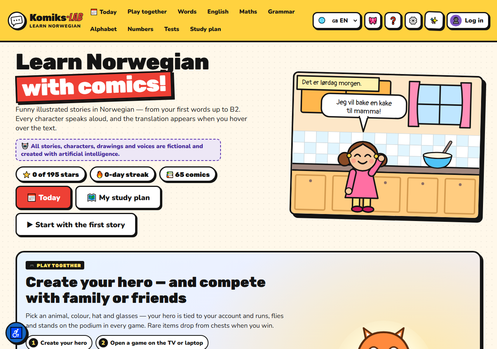

---

## What is inside

| | |
|---|---|
| 📚 **65 comics** | A1 → B2: the shop, the doctor, NAV, a flat viewing, a job interview, the tax return, a water leak, the Norwegian exam |
| 🔊 **9 929 voiced clips** | every line, every word and every praise phrase, recorded with Microsoft neural voices |
| 📝 **972 words in 47 topics** | each with a drawn picture, audio and a translation |
| 📐 **16 grammar topics** | tables, examples and tests: V2 word order, en/ei/et, tenses, prepositions |
| 🎮 **Games** | Logic Race, Math Rocket, chess, play-together rooms with a QR code for the classroom |
| 🌍 **4 interface languages** | Norwegian, English, Ukrainian, Arabic — the learning content is always Norwegian |

---

## Reading a comic

Text, audio and translation in one place. Click any word to hear it on its own; hold the
microphone to say the line yourself and get a pronunciation score.

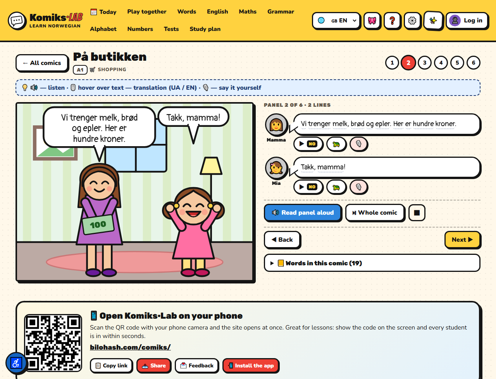

## Tests after every story

Ten question types: who said it, which panel, listening to single words, **listening to whole
sentences with the text hidden**, missing word, typing, true/false, pictures. Four difficulty
levels — the hardest ones add a per-question timer.

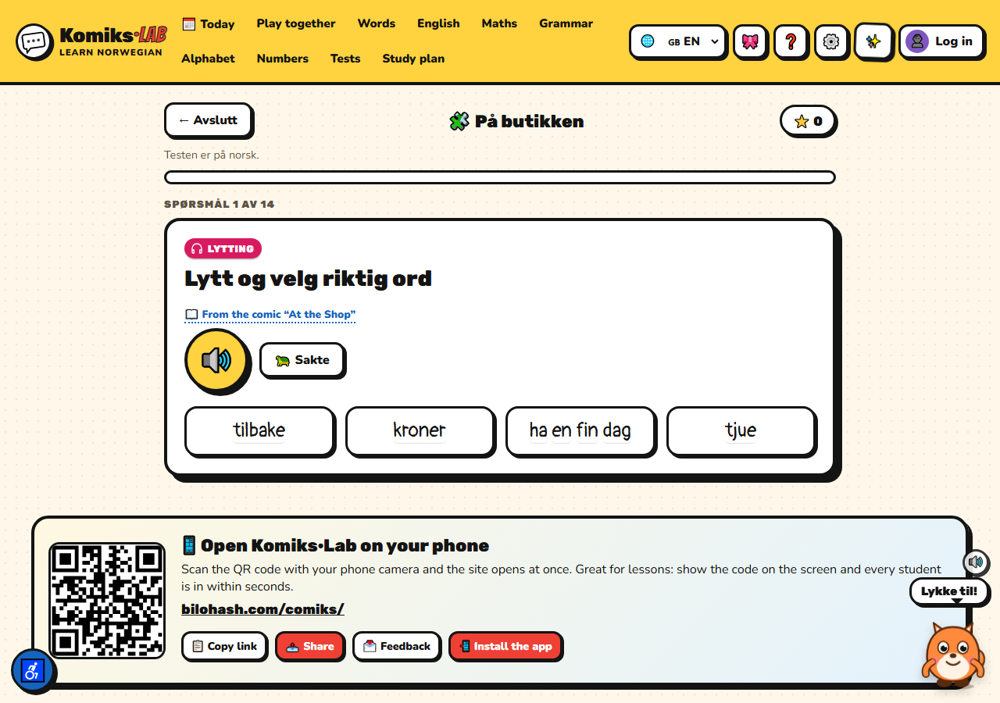

## Words with drawn pictures

Emoji are ambiguous across devices, and many school words have none at all, so the icons are drawn
as SVG in one style — 128 of them so far.

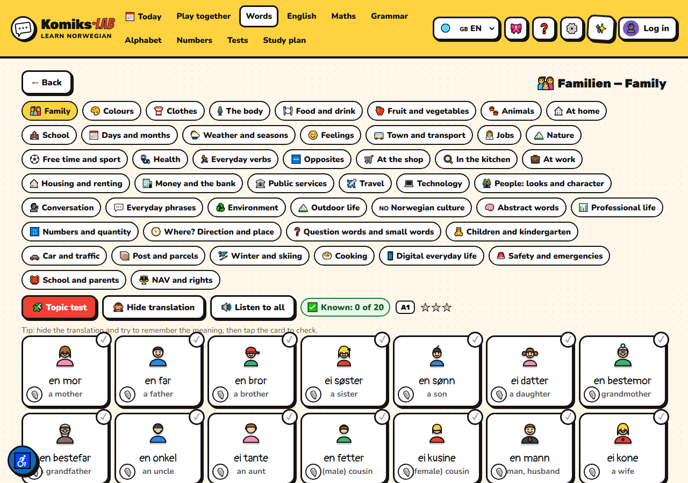

## A ten-minute session every day

“Today” puts three things in front of the learner: the words that are due for review, the next step
of the study plan and the mistakes worth repeating.

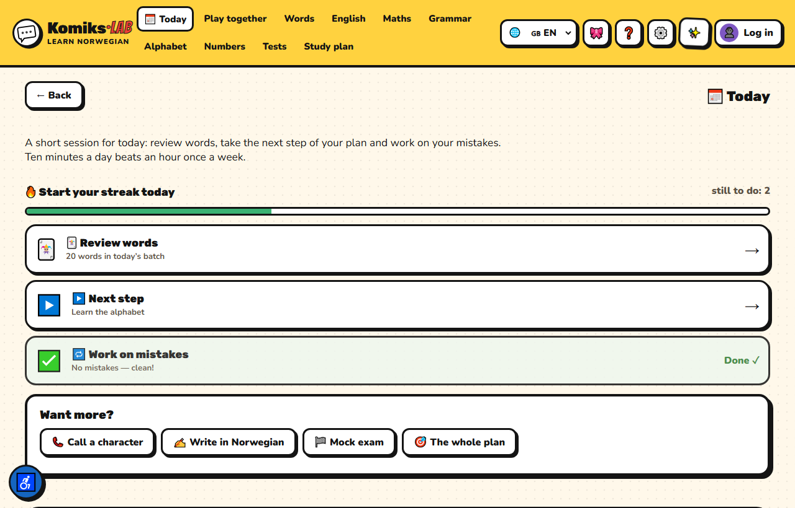

## Spaced repetition

A Leitner box system (0 / 1 / 3 / 7 / 14 days) over the whole vocabulary — both the comic glossary
and the topic words.

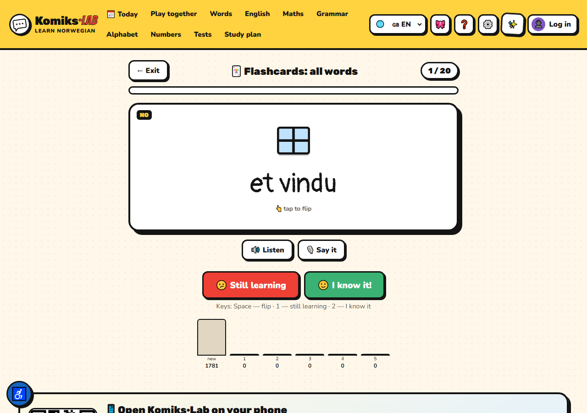

## Writing with feedback

The learner writes a few sentences, and the model returns the corrected text, up to five mistakes
explained in their own language, one piece of advice and a model answer.

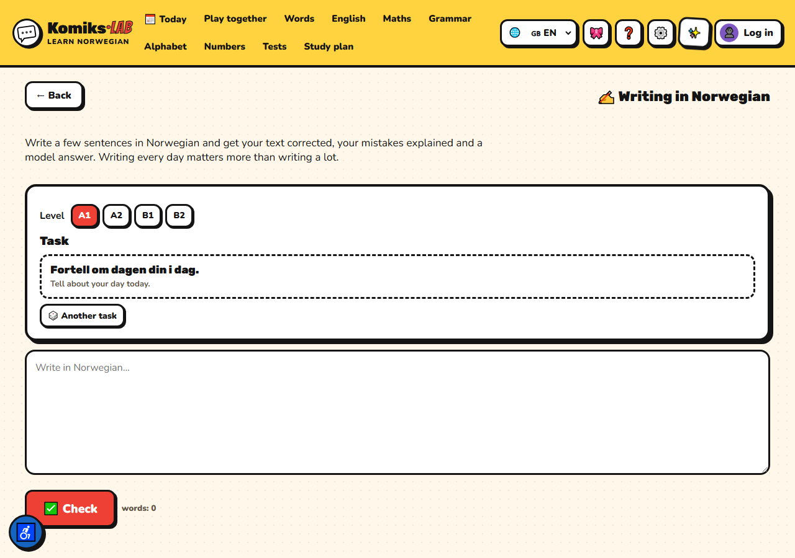

## A study plan and a mock exam

The plan is built week by week from the learner’s level, goal and pace, and ticks itself off as
stories are read and tests are passed. The mock **Norskprøven** adds listening, reading and writing
with an approximate level — practice, not an official result.

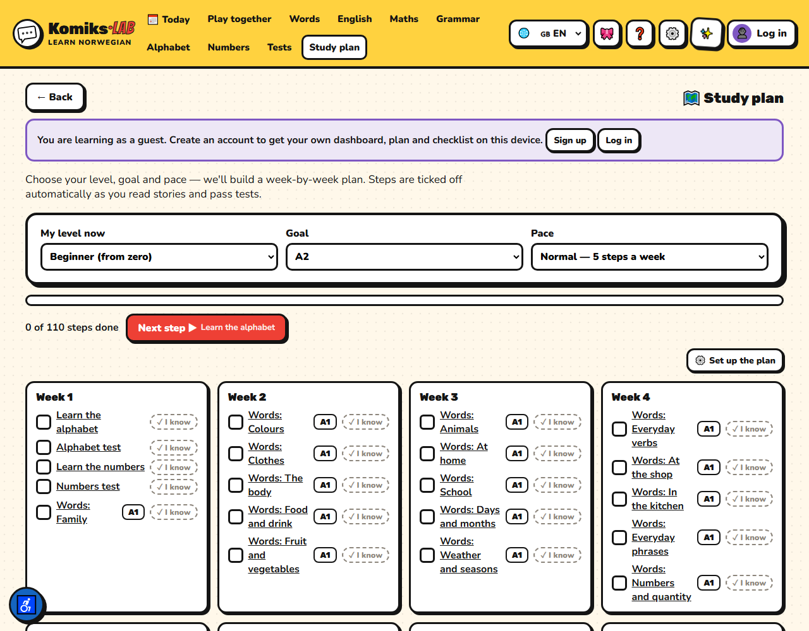

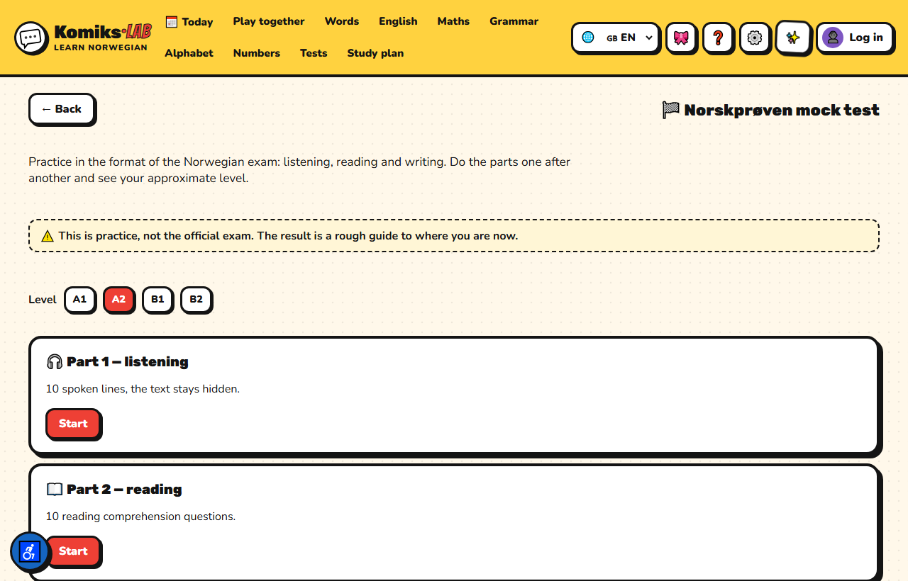

## Phone calls in Norwegian

A fictional character rings you, the phone rings for real, and you talk — by voice or in writing.

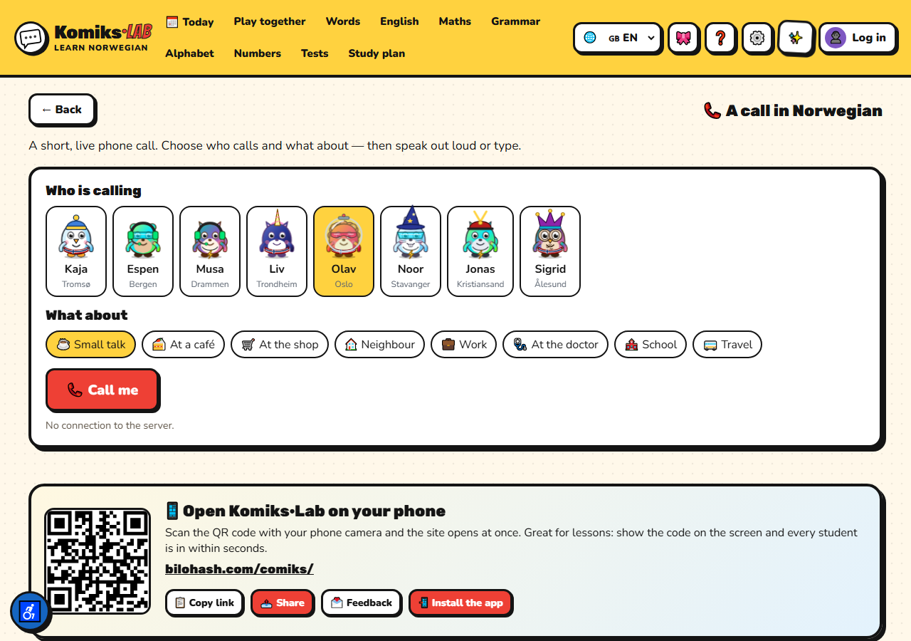

## On a phone

Installs from the browser as a PWA — no App Store, no Google Play. Works offline once opened.

<p>
  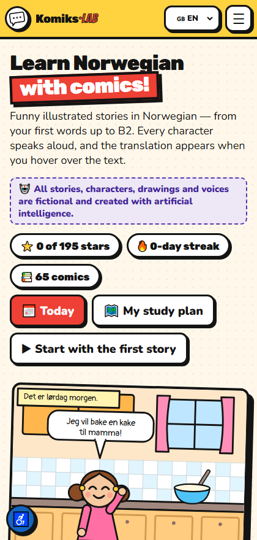
  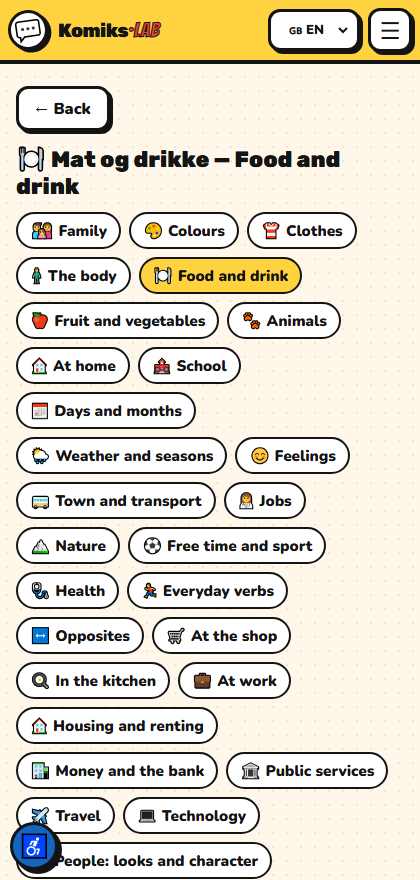
</p>

---

## How it is built

No framework, no bundler, no build step for the browser: plain ES2020 modules loaded in order by
`assets/boot.js` from the registry in `data/index.js`.

```
index.html              the whole app shell
assets/                 app.js (router, quizzes, plan, cards) + one file per feature
  ├─ art.js             the comics are drawn as SVG in code, not stored as images
  ├─ pics*.js           128 drawn icons for words and tests
  ├─ words.js grammar.js english.js math.js race.js chess.js rocket.js
  ├─ write.js exam.js placement.js call.js install.js news.js feedback.js
  └─ style.css          one stylesheet, CSS custom properties, dark mode, high contrast
data/                   comics, dictionaries, word topics, grammar, audio manifest
icons/                  app icons, maskable icons, iOS splash screens
tools/                  build, checks, icon and audio generation, screenshots
app/                    Capacitor scaffold for the Android and iOS builds
docs/screens/           the screenshots in this file
```

### Tools

```bash
node tools/check.js            # every Norwegian word has a Ukrainian and English translation
node tools/build.js            # builds dist/: SEO pages, sitemap, versioned assets
node tools/build-audio-list.js # collects every phrase that needs a voice
python tools/gen_audio.py      # renders the missing mp3 files with edge-tts
python tools/gen-icons.py      # redraws the icon set and the iOS splash screens
node tools/gen-screens.js      # retakes the screenshots in this README
```

### Running it locally

```bash
python -m http.server 8941
```

Then open <http://localhost:8941/>. Reading, tests, words, grammar, games, the plan and the
flashcards all work from the files in this repository.

**The server side is not part of this repository.** Accounts, profile walls, feedback, the AI calls,
the writing check and the subscription live in a PHP API that is not published here, so the pages
that need it stay quiet when it is missing. The audio files are not committed either — about 130 MB
of mp3 — regenerate them with `tools/gen_audio.py` or listen on the live site.

---

## About the content

🤖 All stories, characters, drawings, translations and voices are generated with artificial
intelligence and may contain mistakes. Komiks·Lab is a learning game, not an official course: it
issues no certificates and does not replace a teacher.

---

## License

© BILOHASH — **[bilohash.com/comiks](https://bilohash.com/comiks/)**. All rights reserved.
See [LICENSE](LICENSE): the code and content may be read and studied, but not copied, redistributed
or used commercially without written permission.

## Changelog

See [CHANGELOG.md](CHANGELOG.md) — the same log the app shows under **✨ What’s new**.
